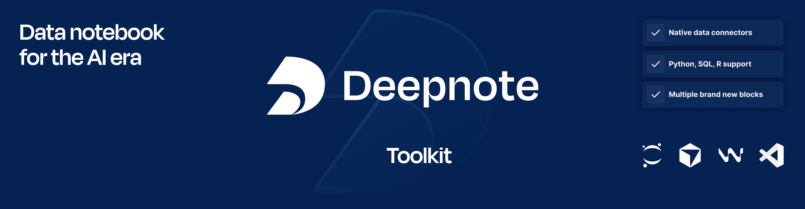

<div align="center">



[Website](https://deepnote.com/?utm_source=github&utm_medium=github&utm_campaign=github&utm_content=readme_main) • [Docs](https://deepnote.com/docs?utm_source=github&utm_medium=github&utm_campaign=github&utm_content=readme_main) • [Blog](https://deepnote.com/blog?utm_source=github&utm_medium=github&utm_campaign=github&utm_content=readme_main) • [X](https://x.com/DeepnoteHQ) • [Examples](https://deepnote.com/explore?utm_source=github&utm_medium=github&utm_campaign=github&utm_content=readme_main) • [Community](https://github.com/deepnote/deepnote/discussions)

[](https://github.com/deepnote/deepnote-toolkit/actions/workflows/ci.yml)
[](https://codecov.io/gh/deepnote/deepnote-toolkit)

[Website](https://deepnote.com/?utm_source=github&utm_medium=github&utm_campaign=github&utm_content=readme_main) • [Docs](https://deepnote.com/docs?utm_source=github&utm_medium=github&utm_campaign=github&utm_content=readme_main) • [Changelog](https://deepnote.com/changelog?utm_source=github&utm_medium=github&utm_campaign=github&utm_content=readme_main) • [X](https://x.com/DeepnoteHQ) • [Examples](https://deepnote.com/explore?utm_source=github&utm_medium=github&utm_campaign=github&utm_content=readme_main) • [Community](https://github.com/deepnote/deepnote/discussions)


</div>

Deepnote Toolkit powers [Deepnote Cloud](https://deepnote.com) and [Deepnote Open Source](https://github.com/deepnote/deepnote).
It starts and manages Jupyter, Streamlit, and LSP servers, and provides runtime integrations for fast and reliable experience.

## Features

- **First-class SQL authoring and execution** without overhead of database connectors and SDKs (all supported integrations with data warehouses, databases, cloud storages, and many other tools are listed in [documentation](https://deepnote.com/docs?utm_source=github&utm_medium=github&utm_campaign=github&utm_content=readme_main))
- **Visualize data with chart blocks**, using Vega, along with additional support for Altair and Plotly
- Native **Deepnote component library** including beautiful `DataFrame` rendering and interactive inputs
- **Python kernel with curated set of libraries preinstalled**, allowing you to focus on work instead of fighting with Python dependencies
- Run multiple **interactive applications built with Streamlit**
- Language Server Protocol integration for code completion and intelligence
- Git integration with SSH/HTTPS authentication

## How to install Deepnote Toolkit

Deepnote Toolkit can be run as a Python package via the CLI, you can also try Deepnote via our [open sourced repositories](https://github.com/deepnote/) including our VS Code, Cursor and Windsurf extensions or via [Deepnote Cloud](https://deepnote.com).

To start Deepnote Toolkit locally, install via `pip` or your favorite package manager:

```sh
pip install deepnote-toolkit
```

To use server components (Jupyter, Streamlit, LSP), add `server` extras bundle:

```sh
pip install deepnote-toolkit[server]
```


## How to run Deepnote Toolkit

To run Deepnote Toolkit after installation use:

```bash
# show all available commands
deepnote-toolkit --help

# start Jupyter server on default port (8888)
deepnote-toolkit server

# start with custom configuration
deepnote-toolkit server --jupyter-port 9000

# view and modify configuration
deepnote-toolkit config show
deepnote-toolkit config set server.jupyter_port 9000
```

**Security note**: The CLI will warn if Jupyter runs without authentication. For local development only. Set `DEEPNOTE_JUPYTER_TOKEN` for shared environments.

## Contributing

For more details on how to set up the local development environment and contribute,
see [contributing guide](./CONTRIBUTING.md).

## Support

- **Documentation**: [deepnote.com/docs](https://deepnote.com/docs)
- **Issues**: [GitHub Issues](https://github.com/deepnote/deepnote-toolkit/issues)
- **Community**: [GitHub Discussions](https://github.com/deepnote/deepnote/discussions)
- **Security**: See [security guideline](SECURITY.md) for reporting vulnerabilities


<hr>
<div align="center">

Built with 💙 by the data-driven team

</div>